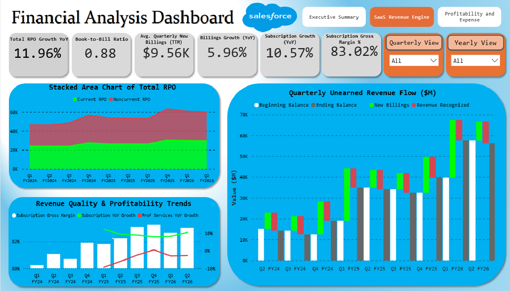
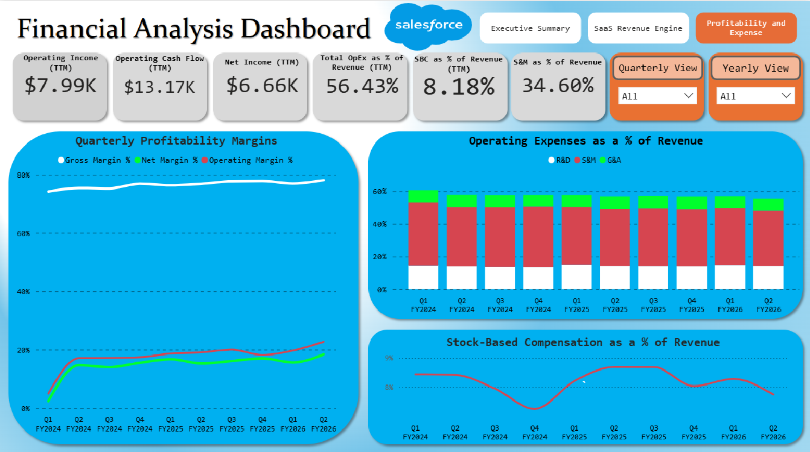
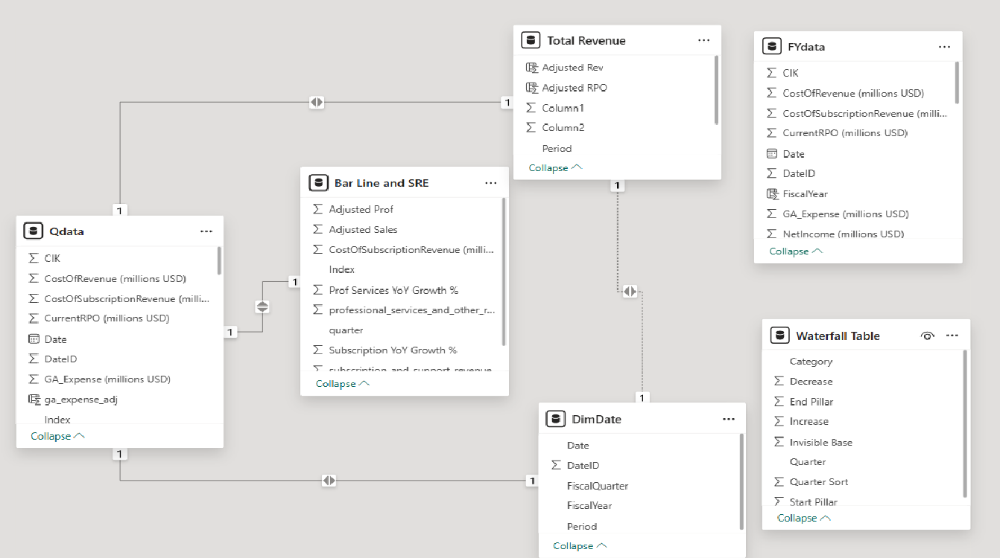

<a id="readme-top"></a>

# Salesforce Financial Analysis Dashboard


A Power BI dashboard project that analyzes Salesforce's financial performance, focusing on revenue pipeline, profitability, and expense efficiency using SEC filing data scraped from the EDGAR database using the edgartools Python library.
---

## Table of Contents
- [Project Overview](#project-overview)
- [Tech-Stack](#tech-stack)
- [ER Diagram](#er-diagram)
- [Dashboard](#dashboard)
- [Insights](#insights)
- [Usage](#usage)
- [Challenges](#challenges)
- [Conclusion](#conclusion)

---

## Project Overview

This project provides a comprehensive blueprint of Salesforce's financial performance, translating raw SEC filings from the EDGAR database into an actionable, analytical dashboard. The EDGAR database (Electronic Data Gathering, Analysis, and Retrieval) is the official public repository maintained by the U.S. Securities and Exchange Commission (SEC). All public companies are required to submit their financial reports and other filings to this system, making it the primary source for this data.

The data was programmatically acquired using the `edgartools` Python library. All SEC filing forms (10-K and 10-Q) were given as a string from the library, so text extraction using Regex was the method I used to gather and consolidate all of the data I needed to build this dashboard.

The dashboard follows a deliberate narrative path, structured across three key pages. It begins with a high-level **Executive Summary** for a consolidated business overview. From there, it guides the user through the **SaaS Revenue Engine**, connecting the "North Star" metric of future pipeline (RPO) to the "Execution Engine" of current billings. Finally, the story lands on **Profitability and Expense**, deconstructing how top-line revenue is converted into tangible operating profit, net income, and cash flow.

The dashboard features interactive features, allowing the user to filter each chart by a specific quarter, or by a specific year in the "Yearly View" for a higher-level overview of the company's metrics.

[<p align="right">(Back to Top)</p>](#readme-top)

---

## Dashboard

The dashboard is organized into three main pages, flowing from a high-level executive summary to a deep dive into revenue and, finally, profitability.

### Executive Summary

This page provides a top-level, consolidated view of the most critical KPIs across the entire business, allowing executives to understand the company's overall health at a single glance. It summarizes performance from pipeline growth to expense management.


### SaaS Revenue Engine

This page analyzes the "top of the funnel," focusing on the future revenue pipeline (RPO), its conversion into new billings (the 'Execution Engine'), and the quality of the resulting subscription revenue.



### Profitability and Expense

This page drills down into the "bottom line," analyzing operational efficiency, expense management (S&M, R&D, G&A as a % of revenue), and overall profitability (Operating Income, Net Income, and Cash Flow).



[<p align="right">(Back to Top)</p>](#readme-top)

---

## ER Diagram



This is an ER Diagram of the data used in the dashboard. Qdata and FYdata are the main data tables used for information. Total Revenue, Waterfall Table, and 
Bar Line and SRE Data are graph specific data tables meant to transform the data in a unique way for easier plotting on PowerBI. DimDate was a table used for easier date calculations when 
creating new measures.

[<p align="right">(Back to Top)</p>](#readme-top)

---

## Tech-Stack

| Category | Tools |
| :--- | :--- |
| **Data Collection** | `edgartools` (Python) |
| **Data Processing** | `Pandas`, `Microsoft Excel` |
| **Data Modeling & Analysis** | `DAX` |
| **Data Visualization** | `PowerBI` |
| **UI Design** | `Powerpoint` |

[<p align="right">(Back to Top)</p>](#readme-top)


---

## Insights

This dashboard tells a cohesive financial story across its three pages. The analysis reveals a company that is successfully leveraging its market-leading position to deliver strong growth *and* rapidly expanding profitability.

### Insight 1: "North Star" (RPO) Signals Long-Term Stability

* **Strong Pipeline Growth:** The "North Star" metric, Total RPO, has grown **12.0% YoY to ~$60B**, providing excellent visibility into future revenue.
* **Strategic Shift to Multi-Year Contracts:** The RPO composition shows `Non-current RPO` (long-term contracts) is growing faster than `Current RPO`.
* **Why it Matters:** This trend is a major strategic positive. It shows a successful sales motion locking in customers on multi-year deals, which increases stability, reduces churn risk, and makes future revenue highly predictable.

### Insight 2: "Execution Engine" Prioritizes High-Quality Revenue

* **Strong Billings Execution:** The "Quarterly Unearned Revenue Flow" chart shows that `New Billings` consistently outpace `Revenue Recognized`, which is why the `Ending Balance` of unearned revenue (a future revenue source) is growing.
* **Focus on High-Margin Subscriptions:** The dashboard shows a clear strategy of prioritizing high-margin revenue. `Subscription Gross Margin` is stable at an impressive **~83%**, while the volatile, low-margin `Professional Services` revenue is not a growth focus.
* **Actionable Warning:** The `Book-to-Bill Ratio (Quarterly)` of **0.90x** must be monitored. While likely a seasonal dip (given strong 16.6% YoY Billings Growth), a sustained ratio below 1.0 would signal a slowdown in the new business pipeline.

### Insight 3: Accelerating Profitability Through Operating Leverage

* **Massive Margin Expansion:** The most powerful story is the dramatic expansion of the `Operating Margin (TTM)`, which has nearly doubled from ~10% to **19.0%**.
* **Driving Efficiency:** This isn't just growth; it's *efficient* growth. The "Operating Expenses as % of Revenue" chart shows `Total OpEx (TTM)` has fallen from ~65% to **56.6%** of revenue.
* **Sales & Marketing Efficiency:** The key driver is the `S&M (TTM)` expense, which has fallen from ~42% to **35.0%** of revenue. This demonstrates significant operating leverage: the company is spending less to acquire each new dollar of revenue.
* **The "War Chest":** This efficiency has turned Salesforce into a cash-generation machine, with `Operating Cash Flow (TTM)` of **$10.0B**. This provides a massive "war chest" for R&D (AI), acquisitions, or shareholder returns.

[<p align="right">(Back to Top)</p>](#readme-top)

---

## Usage

1. Clone the repository:
   ```sh
   !git clone https://github.com/HemuTheReddy/Salesforce-PowerBI-Dashboard
   ```
2. Go to the Power BI file:
  ```sh
  cd PowerBI
  ```
4. Open PowerBI file using PowerBI desktop and explore dashboard.

---


## Challenges

This project involved several technical and analytical hurdles, from data acquisition to final visualization.

* **Data Standardization in SEC Filings:** A primary challenge emerged during the data collection phase. Key financial line items were not named consistently across different quarterly or annual SEC filings. For example, a critical operating expense was labeled "Sales and Marketing" in some reports and "Marketing and Sales" in others. This required manually auditing the source filings to identify all variations. I then built robust conditional logic into the `edgartools` Python scraper to programmatically catch these discrepancies, standardize the field names during the ETL process, and ensure the final dataset was clean and reliable.

* **Custom Waterfall Visualization:** The "Quarterly Unearned Revenue Flow" chart was essential to the dashboard, but it presented a significant technical visualization challenge. The required chart needed to show a starting balance, an addition (New Billings), a subtraction (Revenue Recognized), and an ending balance. The native Power BI waterfall visual is not designed to handle this "flow" logic (it's built for changes from zero). To solve this, I implemented a "floating bar chart" technique, which involved creating a custom data file and writing DAX measures to calculate the start and end points of the floating bars, effectively building a custom visual to accurately represent the financial story.

* **Balancing Domain Knowledge with Data Constraints:** A core challenge was developing the necessary financial domain knowledge to tell a meaningful story. I had to research the key metrics for a high-growth SaaS business (like RPO, Book-to-Bill, TTM calculations) and understand their impact. The difficulty was then balancing these "ideal" KPIs against the hard constraints of the data available in public SEC filings. I was limited to what the company reported, so I had to find the most insightful and high-impact metrics (like `Operating Cash Flow (TTM)` or `Stock-Based Comp as % of Revenue`) that could be rigorously and accurately derived from the source data.

[<p align="right">(Back to Top)</p>](#readme-top)

---

## Conclusion

*(Summarize the project. What was the final result? What are potential future improvements?)*

[<p align="right">(Back to Top)</p>](#readme-top)
