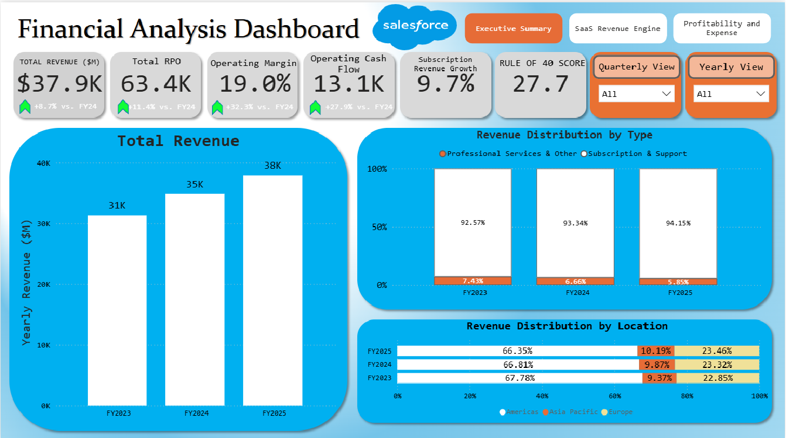
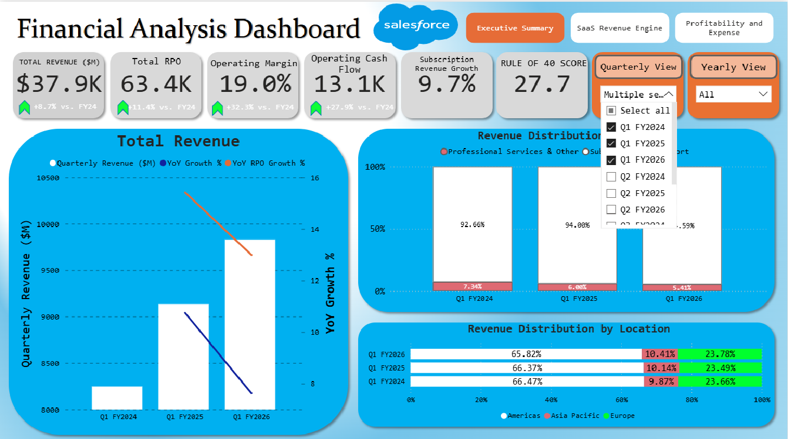

<a id="readme-top"></a>

# Salesforce Financial Analysis Dashboard


A Power BI dashboard project that analyzes Salesforce's financial performance, focusing on revenue pipeline, profitability, and expense efficiency using SEC filing data scraped from the EDGAR database using the edgartools Python library.
---

## Table of Contents
- [Project Overview](#project-overview)
- [Tech-Stack](#tech-stack)
- [ER Diagram](#er-diagram)
- [Dashboard](#dashboard)
- [Insights](#insights)
- [Usage](#usage)
- [Challenges](#challenges)
- [Conclusion](#conclusion)

---

## Project Overview

This project provides a comprehensive blueprint of Salesforce's financial performance, translating raw SEC filings from the EDGAR database into an actionable, analytical dashboard. The EDGAR database (Electronic Data Gathering, Analysis, and Retrieval) is the official public repository maintained by the U.S. Securities and Exchange Commission (SEC). All public companies are required to submit their financial reports and other filings to this system, making it the primary source for this data.

The data was programmatically acquired using the `edgartools` Python library. All SEC filing forms (10-K and 10-Q) were given as a string from the library, so text extraction using Regex was the method I used to gather and consolidate all of the data I needed to build this dashboard. The file used to do this is `assets/dashboard_scraper.ipynb`.

The dashboard follows a deliberate narrative path, structured across three key pages. It begins with a high-level **Executive Summary** for a consolidated business overview. From there, it guides the user through the **SaaS Revenue Engine**, connecting the "North Star" metric of future pipeline (RPO) to the "Execution Engine" of current billings. Finally, the story lands on **Profitability and Expense**, deconstructing how top-line revenue is converted into tangible operating profit, net income, and cash flow.

The dashboard features interactive features, allowing the user to filter each chart by a specific quarter, or by a specific year in the "Yearly View" for a higher-level overview of the company's metrics.

[<p align="right">(Back to Top)</p>](#readme-top)

---

## Dashboard

The dashboard is organized into three main pages, flowing from a high-level executive summary to a deep dive into revenue and, finally, profitability.

### Executive Summary

This page provides a top-level, consolidated view of the most critical KPIs across the entire business, allowing executives to understand the company's overall health at a single glance. It summarizes performance from pipeline growth to expense management.


### SaaS Revenue Engine

This page analyzes the "top of the funnel," focusing on the future revenue pipeline (RPO), its conversion into new billings (the 'Execution Engine'), and the quality of the resulting subscription revenue.


### Profitability and Expense

This page drills down into the "bottom line," analyzing operational efficiency, expense management (S&M, R&D, G&A as a % of revenue), and overall profitability (Operating Income, Net Income, and Cash Flow).


### Interactivity 
<table>
  <tr>
    <th>Yearly Filter</th>
    <th>Quarterly Filter</th>
  </tr>
  <tr>
    <td></td>
    <td></td>
  </tr>
  <tr>
    <td>This section shows the yearly filter, which allows users to see a higher level overview of the data.</td>
    <td>This section shows the custom quarter filter, whch allows users to explore specific quarters from the data.</td>
  </tr>
</table>

[<p align="right">(Back to Top)</p>](#readme-top)

---

## ER Diagram


This is an ER Diagram of the data used in the dashboard. Qdata and FYdata are the main data tables used for information. Total Revenue, Waterfall Table, and 
Bar Line and SRE Data are graph specific data tables meant to transform the data in a unique way for easier plotting on PowerBI. DimDate was a table used for easier date calculations when 
creating new measures.

[<p align="right">(Back to Top)</p>](#readme-top)

---

## Tech-Stack

| Category | Tools |
| :--- | :--- |
| **Data Collection** | `edgartools` (Python) |
| **Data Processing** | `Pandas`, `Microsoft Excel` |
| **Data Modeling & Analysis** | `DAX` |
| **Data Visualization** | `PowerBI` |
| **UI Design** | `Powerpoint` |

[<p align="right">(Back to Top)</p>](#readme-top)


---

## Insights
This dashboard reveals Salesforce's successful transformation from growth-at-all-costs to profitable, sustainable expansion. The company demonstrates strong execution across revenue quality, operational efficiency, and pipeline health, positioning itself as a mature, cash-generative enterprise software leader while maintaining solid growth momentum.

### Insight 1: Strong Pipeline Growth with Deceleration Warning
RPO as the Leading Indicator: Total RPO has grown to $63.4K (+11.4% YoY), significantly outpacing revenue growth of +8.7%, indicating a healthy sales pipeline that should support continued revenue expansion through FY2026. Current RPO reached $30.2K, closely aligning with the $37.9K annual revenue run rate and validating strong conversion efficiency. However, both revenue growth (from 11.2% to 8.7% YoY) and RPO growth (from 15.4% to 12.0% YoY) show consistent deceleration. While the company maintains solid momentum, the narrowing gap between RPO and revenue growth suggests potential for further growth rate moderation in future quarters. The Book-to-Bill ratio of 0.88 reinforces this cautionary signal, indicating current bookings are running slightly below revenue recognition rates.

### Insight 2: Exceptional Revenue Quality and Strategic Repositioning
Subscription Dominance: Subscription revenue now represents 94.15% of total revenue (up from 92.57% in FY2023), making Salesforce's revenue base increasingly predictable and stable. Professional Services revenue has strategically declined from $2.33B to $2.22B (-4.7% absolute), representing a deliberate shift away from lower-margin services toward high-margin subscription offerings. The Subscription Gross Margin maintains an industry-leading 82-83% consistently across all periods, demonstrating operational excellence in cloud delivery. New billings averaging $9.56K per quarter continue to outpace revenue recognition, driving the Unearned Revenue balance to $20.7K, a substantial future revenue reservoir. This revenue mix improvement represents one of the clearest signs of business model maturation and quality enhancement.

### Insight 3: Dramatic Profitability Transformation Through Operating Leverage
Remarkable Margin Expansion: Operating Margin has exploded from 3.3% (FY2023) to 19.0% (FY2025), with Q2 FY2026 reaching 22.8%—a 1,570 basis point improvement in just two years. This transformation reflects true operating leverage: operating income grew 600% while revenue grew only 21%. Total Operating Expenses decreased from approximately 65% to 56.4% of revenue, with Sales & Marketing efficiency driving the improvement from ~42% to 35.0% of revenue. The company now generates $13.1K in operating cash flow (34.6% margin), demonstrating exceptional cash conversion. Stock-based compensation remains well-controlled at 8.2% of revenue. This efficiency transformation has created a powerful cash generation engine while maintaining R&D investment at 14.5% of revenue to fund AI and innovation initiatives.

### Insight 4: Geographic Diversification and Rule of 40 Performance
Reducing Americas Concentration: Salesforce has successfully diversified its geographic footprint, with Americas declining from 67.78% to 66.35% of revenue while Europe and APAC expand to 23.46% and 10.19% respectively. APAC shows the strongest momentum with 104 basis points of share gains, indicating successful emerging market penetration. All three regions show healthy absolute dollar growth, demonstrating broad-based global demand. The Rule of 40 score of 27.7 (combining ~9% growth + ~19% margin) reflects a maturing SaaS business that has successfully optimized the growth-profitability tradeoff. While below the ideal 40 threshold, the score has doubled from ~14 in FY2023, representing dramatic progress. For a company at Salesforce's scale ($38B revenue), this balanced performance with accelerating margins and decelerating but solid growth represents a healthy, sustainable business model positioned for continued value creation.

<p align="right">(Back to Top)</p>


---

## Usage

1. Clone the repository:
```sh
!git clone https://github.com/HemuTheReddy/Salesforce-PowerBI-Dashboard
```
2. Go to the Power BI file:
  ```sh
  cd PowerBI
  ```
3. Open PowerBI file using PowerBI desktop and explore dashboard.

---


## Challenges

This project involved several technical and analytical hurdles, from data acquisition to final visualization.

* **Data Standardization in SEC Filings:** A primary challenge emerged during the data collection phase. Key financial line items were not named consistently across different quarterly or annual SEC filings. For example, a critical operating expense was labeled "Sales and Marketing" in some reports and "Marketing and Sales" in others. This required manually auditing the source filings to identify all variations. I then built robust conditional logic into the `edgartools` Python scraper to programmatically catch these discrepancies, standardize the field names during the ETL process, and ensure the final dataset was clean and reliable.

* **Custom Waterfall Visualization:** The "Quarterly Unearned Revenue Flow" chart was essential to the dashboard, but it presented a significant technical visualization challenge. The required chart needed to show a starting balance, an addition (New Billings), a subtraction (Revenue Recognized), and an ending balance. The native Power BI waterfall visual is not designed to handle this "flow" logic (it's built for changes from zero). To solve this, I implemented a "floating bar chart" technique, which involved creating a custom data file and writing DAX measures to calculate the start and end points of the floating bars, effectively building a custom visual to accurately represent the financial story.

* **Balancing Domain Knowledge with Data Constraints:** A core challenge was developing the necessary financial domain knowledge to tell a meaningful story. I had to research the key metrics for a high-growth SaaS business (like RPO, Book-to-Bill, TTM calculations) and understand their impact. The difficulty was then balancing these "ideal" KPIs against the hard constraints of the data available in public SEC filings. I was limited to what the company reported, so I had to find the most insightful and high-impact metrics (like `Operating Cash Flow (TTM)` or `Stock-Based Comp as % of Revenue`) that could be rigorously and accurately derived from the source data.

[<p align="right">(Back to Top)</p>](#readme-top)

---

## Conclusion

Salesforce's financial trajectory demonstrates a textbook transformation from a growth-focused to a profitably-growing enterprise SaaS leader. The company has achieved what many mature software businesses struggle with: maintaining high single-digit revenue growth while dramatically expanding operating margins from 3.3% to 19.0% in just two years. The improving revenue quality (94%+ subscription mix), strong cash generation ($13.1K operating cash flow), and healthy forward pipeline (RPO growing 11.4% YoY) position Salesforce as a financially robust, well-diversified market leader. While growth deceleration and the below-parity Book-to-Bill ratio of 0.88 warrant monitoring, the overall financial health remains strong with a Rule of 40 score of 27.7 trending upward.
Further Improvements & Data Limitations

This analysis is constrained by the available financial data and could be significantly enhanced with additional metrics. Customer-level insights such as Net Revenue Retention (NRR), customer acquisition costs (CAC), customer lifetime value (LTV), and churn rates would provide critical visibility into unit economics and cohort performance. Product-specific revenue breakdowns (Sales Cloud, Service Cloud, Marketing Cloud, Slack, Tableau, MuleSoft) would reveal which segments drive growth and which face headwinds. Billings data and deferred revenue movements on a more granular basis would improve the accuracy of pipeline analysis beyond the current Book-to-Bill proxy. Free cash flow details including capital expenditures would provide a clearer picture of true cash generation. Finally, competitive benchmarking data against peers like Microsoft Dynamics, Oracle, and SAP would contextualize Salesforce's performance relative to the broader enterprise software market. Future iterations of this dashboard should incorporate these variables to enable deeper strategic analysis and more actionable business intelligence.

<p align="right">(Back to Top)</p>
